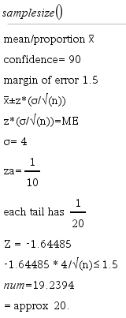
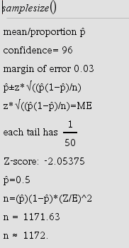

# NspireSampleSizeSolve v1

[By Mason Cole](https://www.mason-cole.com)

Solves for the sample size needed to achieve the desired accuracy for a predicted interval. ?is used when no std. deviation is provided and ?is used when the std. of deviation is known.

>##Place the .tns file in the MyLibs tolder for easy access
 

